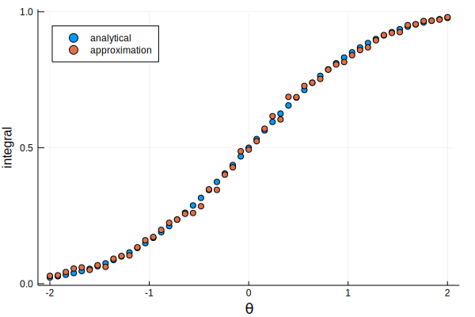
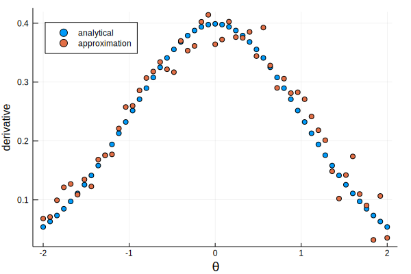

+++
date = 2017-09-15T16:03:10+02:00
draft = false
title = "Automatic differentiation of discontinuous integrals"
slug = ""
categories = [""]
tags = ["julia", "automatic differentiation", "ForwardDiff"]
+++

This is a *much simplified* writeup of a problem I encountered, in a self-contained blog post.

You want to approximate the integral
\[
I(\theta) = \int 1(g(x) > 0) f(x,\theta) dx
\]
where $g$ is a continuous function, and $f(x,\theta)$ is a parametric distribution over $x$. Everthing is continous, and thus $I$ is, too.

You face the following constraints:

1. $g$ is a black box. We will pretend that you can't invert it (except for checking our results, of course).

2. You can calculate the probability density function $f$ and even draw $x$'s for a particular $\theta$, but that's pretty much it. You don't even get a cdf! (Again, except for checking our results.)

Using Monte Carlo methods, you can do the following:

1. draw $x_i \sim F(\cdot, \theta)$, $i=1,\dots,N$,

2. approximate
\[
I(\theta) \approx \frac{1}{N}\sum_i 1(g(x\_i) > 0)
\]

You could code this in Julia as
```julia
d = distr(θ)   # suppose this returns some distribution that supports Base.rand
x = rand(d, N)
mean(g.(x) > 0)
```

So far, neat and simple. Now, the fly in the ointment: **you need the derivative** $I'(\theta)$ for optimization or Hamiltonian Monte Carlo. The problem is that you cannot `ForwardDiff` your way through the code above: AD'ing a discontinuous step function will just give you $0$, and `rand` does not work with `ForwardDiff.Dual`s anyway (which is very sensible).

However, there *is* a solution: rewrite the approximation as
\[
I(\theta; \theta\_0) \approx \frac{1}{N}\sum_i 1(g(x\_i) > 0) \frac{f(x\_i,\theta)}{f(x\_i,\theta\_0)}
\]
where $\theta\_0$ is the parameter used to simulate the $x\_i$. Differentiate the above at $\theta = \theta\_0$. This approximates
\[
I'(\theta) = \int 1(g(x) > 0) \frac{\partial f(x,\theta)/\partial \theta}{f(x,\theta)}f(x,\theta) dx = \int 1(g(x) > 0) \partial f(x,\theta)/\partial \theta dx
\]
which is exactly what you want.

Assume that the actual calculation is very complicated, so we would rather avoid implementing it for the integral and the derivative separately. It turns out that this is very simple to do with `ForwardDiff.Dual` values: the code is literally a one-liner and a fallback method:
```julia
elasticity(x::Real) = one(x)
elasticity(x::Dual{T,V,N}) where {T,V,N} = Dual{T}(one(V), partials(x) / value(x))
```
which you can use in a function like
```julia
integral_approx(g, d, x) = mean((g.(x) .> 0) .* elasticity.(pdf.(d, x)))
```

I demonstrate this with $g(x) = x$ and $x \sim \text{Normal}(\theta, 1)$, for which of course we know that the analytical values for $I$ and $I'$ are the right tail probability and the pdf at 0, respectively.

Graphs below show that the approximation is reasonable --- we could make it much better with [low-discrepancy sequences](https://github.com/stevengj/Sobol.jl), but that is an orthogonal issue.





It is amazing how much you can accomplish with two lines of code in Julia! The problem that motivated this blog post is multivariate with irregular regions over which $\{ x: g(x) > 0 \}$, but I used `elasticity` as above.

Self-contained code for everything is available below.



