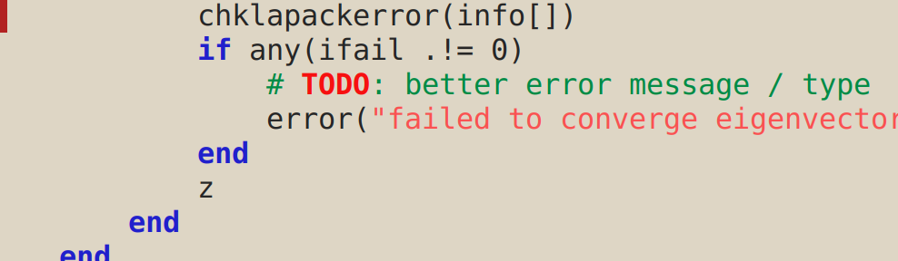
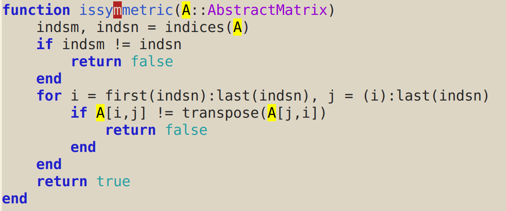
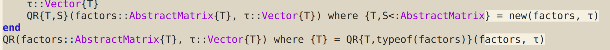

+++
date = 2017-08-28T14:41:58+02:00
draft = false
title = "Emacs customizations for julia-mode"
slug = ""
categories = [""]
tags = ["julia", "emacs"]
+++

I find the following customizations very useful for *editing* Julia
code in Emacs. Add them to `julia-mode-hook`, eg
```emacs-lisp
(defun customize-julia-mode ()
  "Customize julia-mode."
  (interactive)
  ;; my customizations go here
  )

(add-hook 'julia-mode-hook 'customize-julia-mode)
```

## Highlight FIXME/TODO/...

When I just want to note something in a comment for future reference,
I prefer to have certain words highlighted. You can use something like
this:

```emacs-lisp
(font-lock-add-keywords nil
                        '(("\\<\\(FIXME\\|TODO\\|QUESTION\\|NOTE\\)"
                        1 font-lock-warning-face t)))
```

This is what it looks like:



## Highlight symbols

After
```emacs-lisp
(require 'highlight-symbol)
```
add a hook for
```emacs-lisp
(local-set-key [(control ?c) ?s] 'highlight-symbol-at-point)
(local-set-key [(control ?c) ?n] 'highlight-symbol-next)
(local-set-key [(control ?c) ?p] 'highlight-symbol-prev)
```
This highlights symbols with `C-c s`:



## Fill docstrings

This is useful if you want to use `M-q` on docstrings.

```emacs-lisp
(defun julia-fill-string ()
  "Fill a docstring, preserving newlines before and after triple quotation marks."
  (interactive)
  (if (and transient-mark-mode mark-active)
      (fill-region (region-beginning) (region-end) nil t)
    (cl-flet ((fill-if-string ()
                              (when (or (looking-at (rx "\"\"\""
                                                        (group
                                                         (*? (or (not (any "\\"))
                                                                 (seq "\\" anything))))
                                                        "\"\"\""))
                                        (looking-at (rx "\""
                                                        (group
                                                         (*? (or (not (any "\\"))
                                                                 (seq "\\" anything))))
                                                        "\"")))
                                (let ((start (match-beginning 1))
                                      (end (match-end 1)))
                                  ;; (ess-blink-region start end)
                                  (fill-region start end nil nil nil)))))
      (save-excursion
        (let ((s (syntax-ppss)))
          (when (fourth s) (goto-char (ninth s))))
        (fill-if-string)))))
```

Add
```emacs-lisp
(local-set-key (kbd "M-q") 'julia-fill-string)
```
to the mode hook.

## Highlight things after column 80

I add this to the mode hook:

```emacs-lisp
(set-fill-column 80)
```

I also use `whitespace` globally:

```emacs-lisp
(require 'whitespace)
(setq whitespace-style '(face empty tabs lines-tail trailing))
(global-whitespace-mode t)
```

This is what it looks like:



## Hungry delete-mode

Add this to the mode hook:
```emacs-lisp
(hungry-delete-mode)
```
and then backspace and delete will remove all whitespace near the point in the relevant direction.

In case you are wondering, the theme is [alect-light](https://github.com/alezost/alect-themes).
